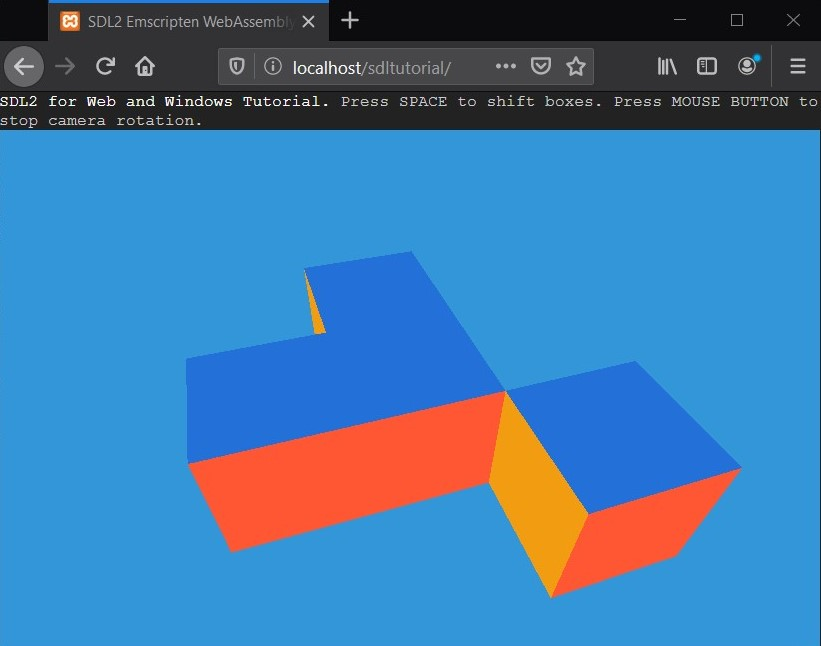
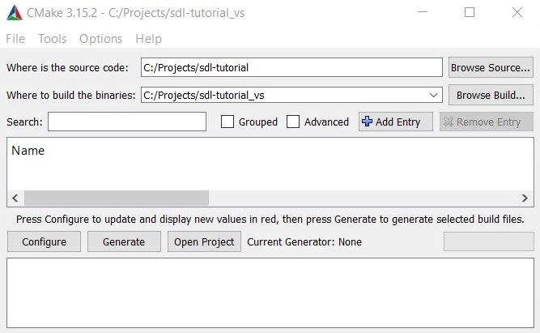
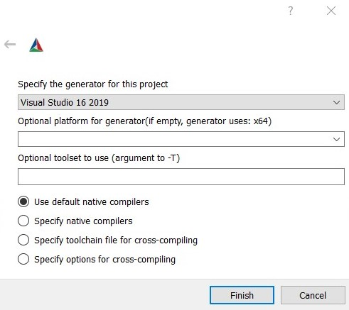
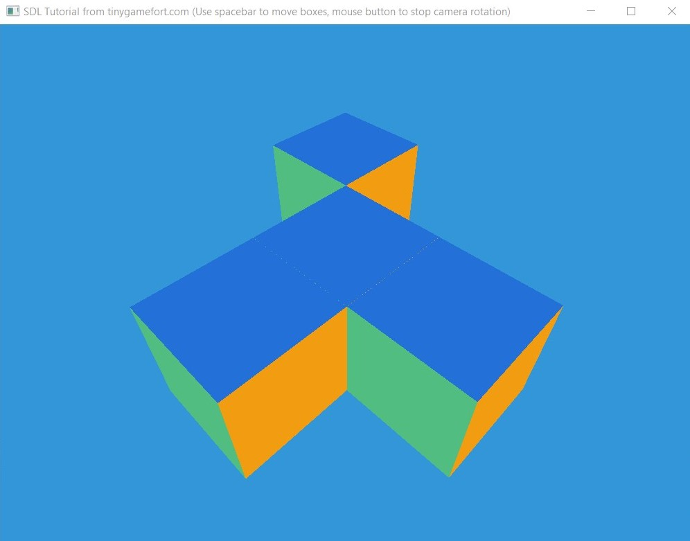
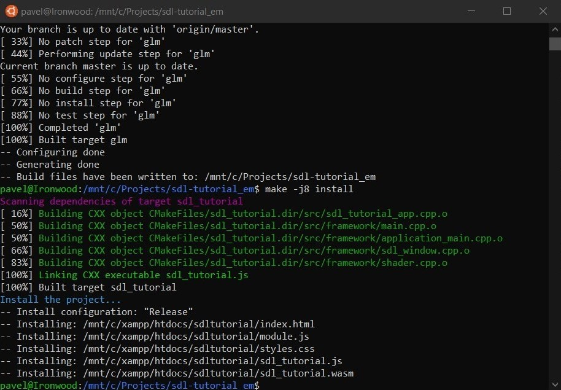
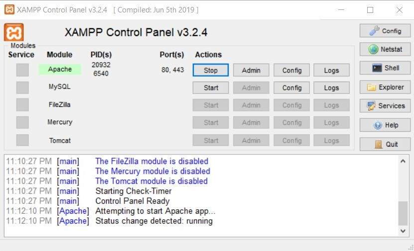

## SDL2 with OpenGL for Web and Windows Tutorial.
### How to configure C++ projects for developing under Web with Emscripten and WebAssembly.

## Intro

This is a demonstration of basics of how to start developing a C++ application for WebAssembly on Windows. The tutorial is based on my project <a href="https://tinygamefort.com">Tiny Game Fort</a>.

## Tools, libraries and setup

This libraries and tools are used at the moment of writing of this tutorial:
- <a href="https://emscripten.org/">Emscripten</a> (1.39.11)
- <a href="https://www.libsdl.org/">SDL2</a> (2.0.12)
- <a href="http://glew.sourceforge.net/">Glew</a> (2.1.0)
- <a href="https://glm.g-truc.net/">GLM</a> (0.9.9.7)
- <a href="https://www.apachefriends.org/">XAMPP</a>
- <a href="https://cmake.org/">CMake</a>
- <a href="https://docs.microsoft.com/en-us/windows/wsl/install-win10">Linux for Windows</a>

First of all you need to install <a href="https://docs.microsoft.com/en-us/windows/wsl/install-win10">Linux for Windows</a> on your system. You need also install all necessary packages like Git, CMake, Python and Java on your Linux system: `sudo apt-get install git python3.6 cmake openjdk-8-jre`

Then use this <a href="https://webassembly.org/getting-started/developers-guide/">developers guide</a> to install Emscripten. The SDL2 and Glew libraries and binaries for x64 are included in tutorial repository. GLM library will be automatically cloned from the official repo when CMake starts. Make sure that Windows system also has CMake installed to generate a project for Visual Studio. Last thing is XAMPP for launching a Web application and WebAssembly binaries locally and test it on desktop and mobile devices. You can use other any other web server you want. XAMPP here is because it is easy to use without any setup.

Clone tutorial source code: `git clone https://github.com/metalpavel/tutorials.git`

## Generate CMake project for Windows

Launch cmake-gui, choose a sdl-tutorial folder for source code and any build folder, for example: C:/Projects/sdl-tutorial_vs.

Click on Configure button. In the new CMake Setup window select Visual Studio 16 2019 generator.

Wait till configuration is done and click on Generate. If everything finished without errors it’s time to click on Open Project. Specify a Startup Project as sdl_tutorial and click on Start Debugging.

## Generate CMake project for Emscripten

Before proceeding, make sure that <a href="https://webassembly.org/getting-started/developers-guide/">Emscripten SDK</a> and <a href="https://www.apachefriends.org">XAMPP</a> are installed. Create a build folder, for example `C:/Projects/sdl-tutorial_em`. Open Linux terminal and run the CMake command in the build folder. Run the cmake command (replace the paths for your system):

`cmake <path_to>/sdl-tutorial -DCMAKE_TOOLCHAIN_FILE=<emsdk_folder>/upstream/emscripten/cmake/Modules/Platform/Emscripten.cmake -DCMAKE_INSTALL_PREFIX=<path_to_xampp_folder>/htdocs/sdltutorial`

For this command you need to specify the path to `sdl-tutorial`, `CMAKE_TOOLCHAIN_FILE` with the path to Emscripten.cmake, `CMAKE_INSTALL_PREFIX` with the path to xampp/htdocs folder. Now let’s build the project with the command:

`make install`

To launch the web page with the application, start XAMPP Control Panel and start Apache server.

Open page `http://localhost/sdltutorial` in the browser. The page may also be accessible for a mobile, but specify your IP address instead of localhost.
