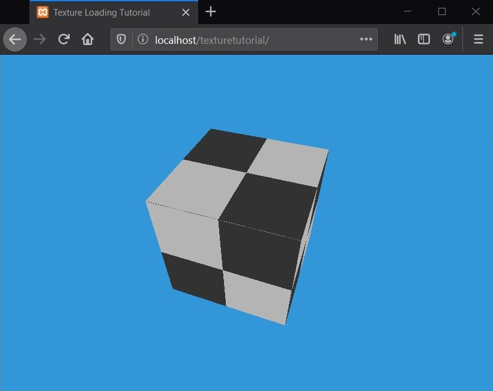
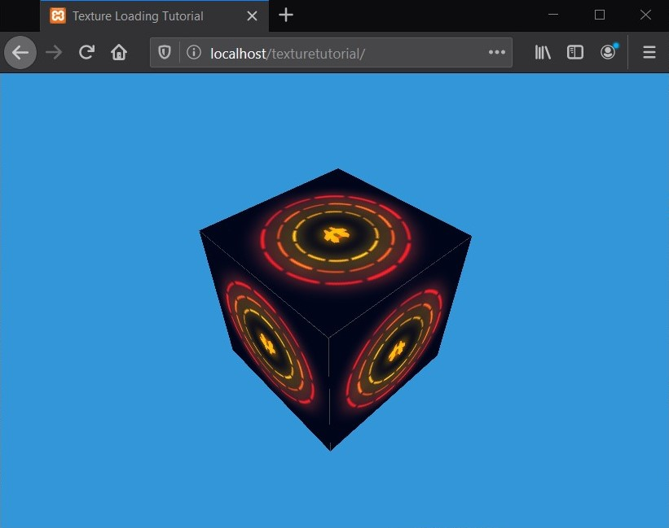

## How to load texture with JavaScript and C++

This tutorial is based on <a href="https://github.com/metalpavel/tutorials/tree/master/sdl-tutorial">sdl-tutorial</a> framework and settings of the toolset is same. Here you can find a simple demonstration of how to download an image and make a texture in OpenGL.

The idea is simple: first we need to create an empty texture while the original image loads.

When the picture is loaded, replace it with the newly created texture.

